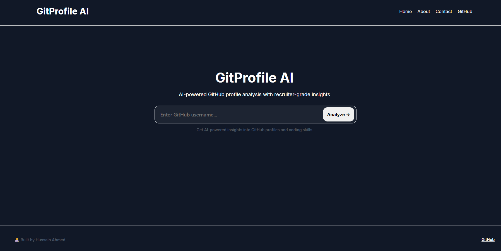

# GitProfile AI

GitProfile AI is a web application that analyzes GitHub profiles using AI to generate recruiter-focused insights.  
It helps developers understand how their profile appears from a hiring perspective and highlights strengths, gaps, and improvement opportunities.

---

## 🚀 Features

- 🔍 GitHub username analysis
- 📊 AI-generated profile insights
- 🧠 Recruiter-style evaluation summaries
- 📌 Strengths and improvement suggestions
- ⚡ Clean and modern UI built with React

---

## 🛠 Tech Stack

**Frontend**
- React
- CSS Modules

**Backend**
- GitHub API integration
- AI API integration

---

## 🎯 Purpose

GitProfile AI was built to bridge the gap between developers and recruiters by transforming raw GitHub data into meaningful, actionable feedback.

Instead of manually guessing what recruiters notice, users receive structured analysis that helps them improve their visibility and presentation.

---

## 📸 Preview



---

## 🌍 Future Improvements

- Detailed repository breakdowns
- Contribution trend visualization
- Skill detection and categorization
- Resume export feature
- Public shareable profile reports

---

## 📦 Installation

```bash
git clone https://github.com/HussBTWYT/gitprofile-ai.git
cd gitprofile-ai
npm install
npm run dev
```

## 💬 Contact
If you're interested in collaboration or feedback, feel free to reach out.
