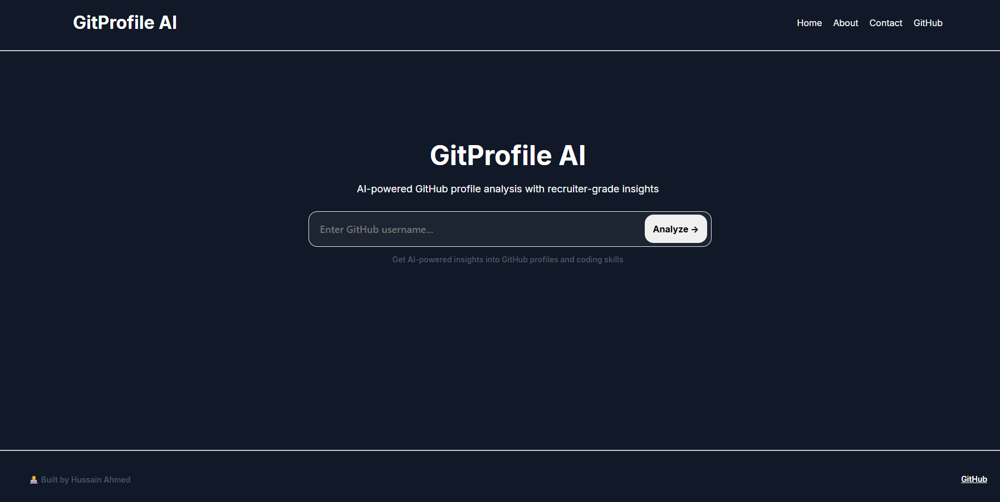
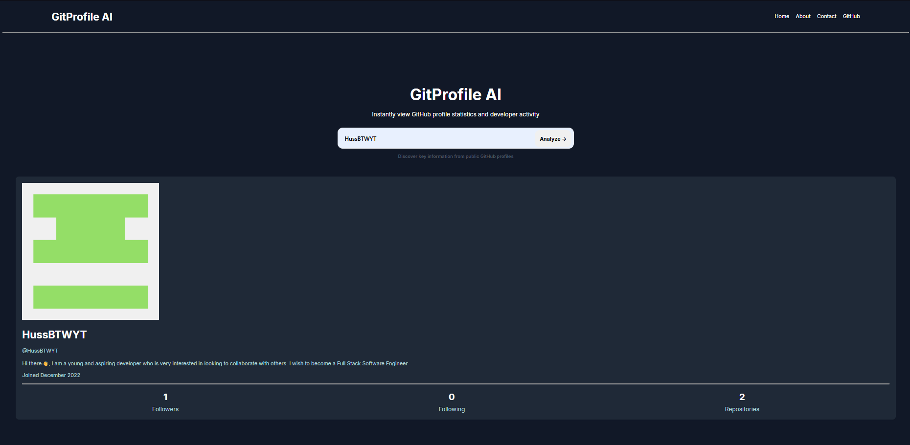

# GitProfile AI

GitProfile is a web application that lets users quickly search and view public GitHub profile information.
It provides an easy way to explore key details such as followers, repositories, and account statistics.

---

## 🚀 Features

- 🔍 GitHub username search
- 📊 Display key profile statistics
- 📌 View followers, following, and public repositories
- ⚡ Clean and modern UI built with React
- 🌐 Fetches live data from the GitHub API

---

## 🛠 Tech Stack

**Frontend**
- React
- CSS Modules

**Backend**
- GitHub REST API integration

---

## 🎯 Purpose

GitProfile was built to make it easy to explore public GitHub profiles and quickly see important account information.

Instead of navigating multiple pages on GitHub, users can instantly search a username and view key statistics and profile details in a simple interface.

---

## 📸 Preview




---

🌍 Future Improvements

- Display user repositories
- Repository sorting (stars, language, etc.)
- Contribution activity visualization
- Improved profile UI and layout

---

## 📦 Installation

```bash
git clone https://github.com/HussBTWYT/gitprofile-ai.git
cd gitprofile-ai
npm install
npm run dev
```

## 💬 Contact
If you're interested in collaboration or feedback, feel free to reach out.
